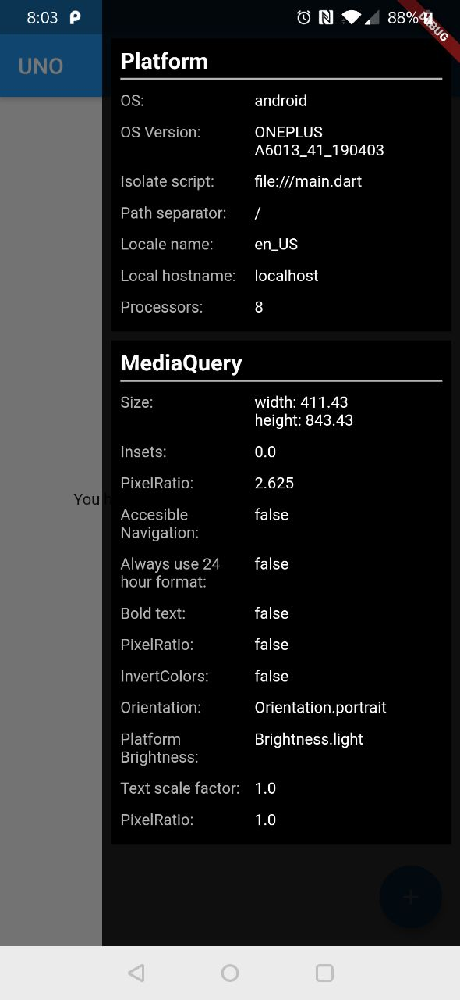

# flutter_debug_drawer

A debug drawer menu for better development. This is an initial release with very few functionalities.

This project is heavily inspired on a similar project for Android (https://github.com/palaima/DebugDrawer)




## Getting Started

Include the last version of the library in your `pubspec.yaml`:

```
    dependencies:
        flutter_debug_drawer: 0.1.1+1
```

Now, you can customize your debug drawer adding it to your main application object:

```
class MyApp extends StatelessWidget {
  @override
  Widget build(BuildContext context) {
    return MaterialApp(
      title: 'Flutter debug drawer demo',
      builder: DebugDrawerBuilder.build(modules: [
        PlatformModule(),
        MediaQueryModule(),
      ]),
      home: MyHomePage(),
    );
  }
}
```

Right now, only PlatformModule and MediaQueryModule are availables. More will come soon.

